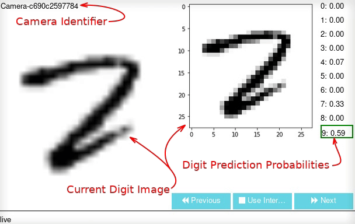
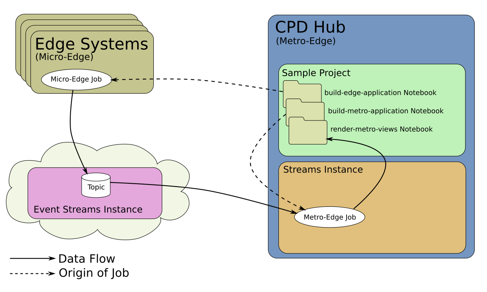

# sample.edge-mnist-notebook

This sample demonstrates the use of a Streams Python Notebook, and Edge Analytics in
Cloud Pak for Data, to recognize digit images using a simple scikit-learn ML
model trained with the standard MNIST digit dataset.  The ML model scores data right at
the micro-edge, but sends back metrics and low-confidence predictions to an application
running on the CP4D hub for later analysis.

## Requirements

This sample requires Cloud Pak for Data (CP4D) and several CP4D services: Streams, Watson Studio,
and Edge Analytics.  A Streams Instance should be provisioned, and Edge systems should be
available. It also requires read/write access to an IBM Event Streams topic, accessible
to the CP4D Streams Instance, as well as the Edge systems.  Depending on where the IBM Event
Streams instance is provisioned, the topic may need to be created on the IBM Cloud.

Please see the appropriate documentation links for installing and provisioning each item.

1. [IBM Cloud Pak for Data 3.0.1](https://www.ibm.com/support/producthub/icpdata/docs/content/SSQNUZ_current/cpd/install/install.html)
2. [Edge Analytics beta service on CP4D](https://www.ibm.com/support/knowledgecenter/SSQNUZ_3.0.1/svc-edge/install.html)
3. [IBM Streams 5.4.0 service on CP4D](https://www.ibm.com/support/producthub/icpdata/docs/content/SSQNUZ_current/cpd/svc/streams/install-intro.html)
4. [Watson Studio service on CP4D](https://www.ibm.com/support/producthub/icpdata/docs/content/SSQNUZ_current/wsj/install/install-ws.html)
5. [Streams Instance](https://www.ibm.com/support/producthub/icpdata/docs/content/SSQNUZ_current/cpd/svc/streams/provision.html#provision)
6. [Edge systems](https://www.ibm.com/support/knowledgecenter/SSQNUZ_3.0.1/svc-edge/admin.html)
7. [IBM Event Streams instance on IBM Cloud](https://ibmstreams.github.io/streamsx.documentation/docs/edgeanalytics/kafka-options#event-streams-in-ibm-cloud)

## Architectural Overview

The sample consists of three primary notebooks:
- `build-edge-application` creates the micro-edge application.
- `build-metro-application` creates the metro-edge application and submits it to run on the CP4D Hub.
- `render-metro-views` displays live information from the metro-edge application, which is receiving
   and aggregating it from the micro-edge applications.

When running on the Edge systems, the **micro-edge application** iterates through a set of test images,
preparing and scoring them against a digit prediction model.  It sends aggregated metrics and
low-certainty images to a topic in Event Streams, which are then picked up by the **metro-edge application**,
running on the CP4D Hub in a Streams instance, where metrics can be aggregated across multiple micro-edge
application instances.

A notebook running in the CP4D Hub can be used to see result data from the metro-edge application (which
is receiving and aggregating data from the micro-edge applications), in real-time,
displaying dashboards of current digit prediction statistics, uncertain digit prediction images and
scores, and a mocked-up "Correction Station", which could be used to re-train the prediction model
to improve accuracy, etc.

## Instructions

### 1. Import the Sample into CP4D as a Project

In order to try out the sample, you need to first import it into CP4D as a new Project.
1. From the Projects interface, choose [New Project](https://www.ibm.com/support/knowledgecenter/SSQNUZ_3.0.1/wsj/getting-started/projects.html).
2. Import by choosing [Create a project from a file](https://www.ibm.com/support/knowledgecenter/SSQNUZ_3.0.1/wsj/manage-data/import-project.html)
   (even though we'll be importing from a GitHub repository, you need to use the "... from a file" option).
3. Select the "From a Git Repository" tab.
4. Enter a Name to identify your project.
5. Choose a Token, if you already have added a GitHub token to CP4D, or [create a new one](https://docs.github.com/en/github/authenticating-to-github/creating-a-personal-access-token)
   and add it to CP4D using the "New Token" link.
6. Enter the Repository URL: [https://github.com/IBMStreams/sample.edge-mnist-notebook.git]
7. Choose the "main" branch.
8. No _not_ enable on-demand synchronization with this git repository.
9. Choose the "Create" button.
Further documentation for creating a project and integrating with Github is available [here](https://www.ibm.com/support/knowledgecenter/SSQNUZ_3.0.1/wsj/manage-data/git-integration.html).

### 2. Build and Deploy Micro-Edge Application
1. Open the `build-edge-application.jupyter-py36` notebook in CP4D for editing and execution (click the pencil icon to the right
   of the notebook you want to edit).
2. In the first code cell, be sure the Streams Instance name (`STREAMS_INSTANCE_NAME`) and the Event Streams topic
   (`EVENTSTREAMS_TOPIC`) are set appropriately to match your environment (Requirements 6 and 7, respectively, above).
   Edit the cell if necessary.
3. Execute each cell in the notebook.
   - Be sure to enter your Event Streams credentials string in the fourth code cell when it prompts.  This should have
     been acquired while setting up the Event Streams instance, above in Requirement 7.
4. The last cell submits the build request and waits for the application image to finish building, which might take a while.
   - After successful completion, the application container image is available in the configured CP4D Docker registry, with
     the image name `edge-camera-classifier-app:v1`.
5. After building the image, it needs to be [packaged for deployment](https://www.ibm.com/support/knowledgecenter/SSQNUZ_3.0.1/svc-edge/usage-register-app.html),
   either directly in CP4D or in Edge Application Manager.
6. Finally, it can be [deployed to edge systems](https://www.ibm.com/support/knowledgecenter/SSQNUZ_3.0.1/svc-edge/usage-deploy.html).
7. Optionally, after the application is running on one or more edge systems, the `testing-kafka.jupyter-py36` notebook
   can be used to directly view the messages the micro-edge application is writing to the Event Streams topic, for debug.
   - Before running the cells in that notebook, be sure to edit the first code cell, and set `EVENTSTREAMS_TOPIC` appropriately,
     as well as setting `SHOW_IMAGES` to True if you wish to see the actual images sent over due to low-confidence predictions, along
     with the possible predictions and scores. If `SHOW_IMAGES` is left at the default False, only the aggregated digit
     prediction and scoring performance metrics will be shown.
   - You'll also need to enter the Event Streams credentials string when prompted, as above.

### 3. Build and Submit Metro-Edge Application
1. Open the `build-metro-application.jupyter-py36` notebook in CP4D for editing and execution.
2. In the first code cell, be sure the Streams Instance name (`STREAMS_INSTANCE_NAME`) and Event Streams topic
   (`EVENTSTREAMS_TOPIC`) are set appropriately to match your environment, as above.  Edit the cell if necessary.
3. Execute each cell in the notebook.
   - Be sure to enter your Event Streams credentials string when it prompts, as above.
4. The last cell submits the build request and waits for the application to finish building.  Once it has finished, it
   submits the application as a job in the local CP4D Streams Instance (that is, this application runs on the CP4D Hub,
   _not_ on an Edge system).
   - The running job can be viewed or cancelled via the CP4D "My Instances" interface, under the "Jobs" tab.

### 4. Observe Running System
Once both applications are up and running, the micro-edge application will be sending occasional aggregate performance
and prediction metrics up to the metro-edge application, along with images that it had a difficult time predicting the digit in
(that is, low confidence in its prediction).  While the metro-edge application could perform some additional analytics or
action on those images and metrics, across all instances of the micro-edge application, the current metro-edge application
just aggregates them and exposes them as Streams Views so that local notebooks can perform interactive analysis of the
current behavior.  The `render-metro-views` notebook is an example of this.
1. Open the `render-metro-views.jupyter-py36` notebook in CP4D for editing and execution.
2. Be sure the Streams Instance name (`STREAMS_INSTANCE_NAME`) is set appropriately to match your environment, as above.
3. Execute the cells in the notebook.
   -  While the early cells simply set up the Streams View connection queues, the last three sections are more notable,
      and probably should be executed one at a time, reading the description and interacting with the graphs and images as
      described in the notebook.

